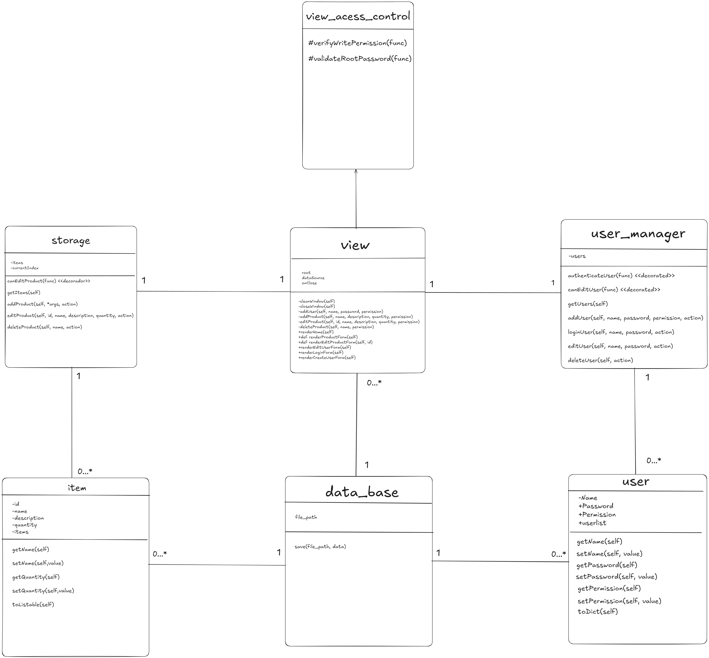

# 📦 Sistema de Almoxarifado

## 📚 Sobre o Projeto

Este projeto é um sistema de **almoxarifado** desenvolvido em **Python**, criado para atender à disciplina de **Programação Orientada a Objetos** da **Universidade Federal de Minas Gerais (UFMG)**.

---

## ⚙️ Requisitos

Para executar o projeto, é necessário ter:

1. A **versão estável do Python** instalada na máquina.  
   Você pode verificar se o Python está instalado com o comando:

   ```bash
   python --version
   ```


---

## 🚀 Execução do Projeto

Para rodar o projeto, siga os passos abaixo:

1. Faça o download ou clone o repositório do projeto:

   ```bash
   git clone https://github.com/Guyrlam/Almoxarifado-Python.git
   ```

2. Execute o projeto com o comando:

   ```bash
   python ./main.py
   ```

3. O sistema iniciará no terminal, permitindo a interação com o menu de gerenciamento do almoxarifado.

---

## 📊 Diagrama UML

Abaixo está o diagrama UML utilizado no desenvolvimento do sistema. Ele ilustra as classes, métodos e relacionamentos do projeto:




---

## 🎓 Créditos
 
Desenvolvido por: Guyrlam Silva Duque, Luis Filipe Resende e Ezequias Kluyvert

---

## 📝 Licença

Este projeto é de uso acadêmico e foi criado exclusivamente para fins educacionais.
